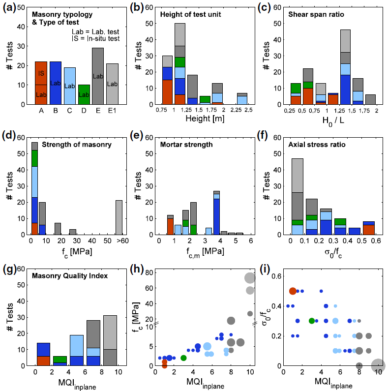
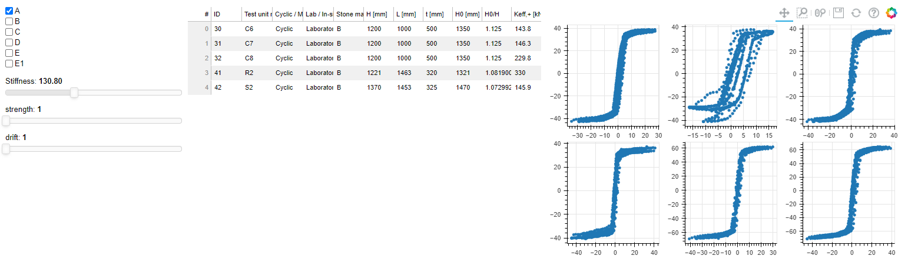

# EESD Stone Masonry Database Dashboard
The aim of this web application is to display graphs of a database of quasi-static cyclic tests on stone masonry walls. The graphs and data are from the paper [Vanin et al. (2017) "Estimates for the stiffness, strength and drift capacity of stone masonry walls based on 123 quasi-static cyclic tests reported in the literature"](https://link.springer.com/article/10.1007/s10518-017-0188-5).
The database can also be accessed [here](https://zenodo.org/record/812146#.YXaBUJ5ByUl). 
This database is maintained and updated as new test results become available. 

This web application displays interactive graphs, which show the important parameters and their distribution within the database for the updated versions of the database. 

The first tab consists of plots that correspond to the subplots of Figure 4 in the paper, which represents the database of shear-compression tests on the stone masonry walls.

The second tab shows the actual data of the database in a data table, along with the corresponding force-displacement response curves for each line.

## Project status
The dashboard is under active development. A first version will be available by Dec 2021.

* Prototype v.1 running at [eesd-stone-masonry.herokuapp.com](https://eesd-stone-masonry.herokuapp.com/)

## Getting started

{Placeholder --> In here share commands to install and run + please share your developping environment (Anaconda yml env, or pipenv txt files)}

### Dependencies

### How to install

### How to run

## Reference
Vanin F., Zaganelli D., Penna A., Beyer K. (2017). Estimates for the stiffness, strength and drift capacity of stone masonry walls based on 123 quasi-static cyclic tests reported in the literature. Bull Earthquake Eng 15, 5435–5479 (2017). [https://doi.org/10.1007/s10518-017-0188-5](https://doi.org/10.1007/s10518-017-0188-5)]

## Data
Database: Vanin F., Zaganelli D., Penna A., Beyer K. (2017). Data set to "Estimates for the stiffness, strength and drift capacity of stone masonry walls based on 123 quasi-static cyclic tests reported in the literature". [http://doi.org/10.5281/zenodo.812145](http://doi.org/10.5281/zenodo.812145)]

# Authors 

# License 